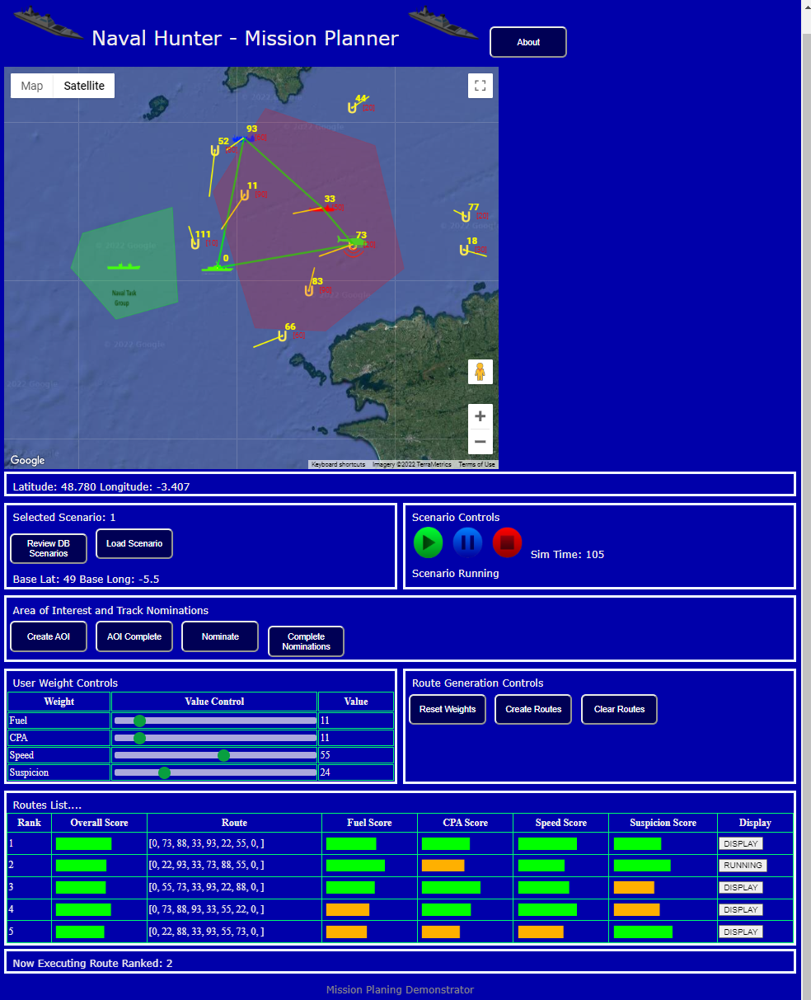
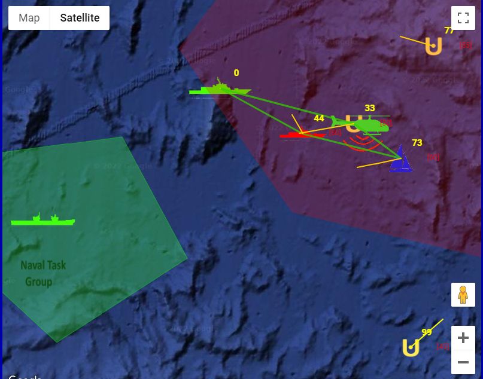
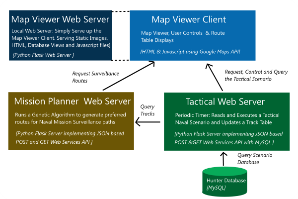

# CS50 NavHunter
#### Video Demo:  https://www.youtube.com/watch?v=g8T0x6u9Neo
### Description:

This Web Application has been developed as a Final Project Submission into the online Harvard CS50 Course.

This is a simple Route Planning for Tactical Surveillance Scenarios. The purpose is to help a user plan routes for a surveillance drone to go out, survey and identify each of the Unknown Tracks appearing within a Naval Tactical scenario. The Surveillance route of the drone is calculated to pass over those unidentifed unknown Tracks, in order to identify those Track vessel Types and so to classify them as being Hostile, Friendly or Neutral. The route planning algorithms utilise a Genetic Algorithm in order to calculate different naval routes depending upon different priority criteria:

*   Shortest Distance (or Fuel usage) - Aka the "Travelling Salesperson Criteria
*   Priority surveillance order of those Tracks appearing Closest Point of approach (CPA) to the Naval Task Group,
*   Priority surveillance order of those Tracks with highest Speed
*   Priority surveillance order of those Tracks exhibiting a high "Suspicion" value

The Drone will launch from Own Ship which is designated as Track 00 in the Scenario. The objectives will be to develop a surveillance route from Own Ship (00) to protect the Naval Task Group (TG) region. And hence any Closest Point of Approach(CPA) calculations will be performed against those Tracks appearing to approach the centre of that region.

* * *

* * *

### Tactical Scenario
 
A number of Tactical Scenarios are maintained in a mySQL Hunter Database. These will illuminate emerging Unknown Tracks appearing within the Tactical Display map view. The Tactical Scenario Controls: Start Pause and Stop the tactical Scenario Running. These Tracks will emerge over time as 'Unknown' Tracks  detected as the ships sensors over time. As each Track is detected, it is allocated a Track Number.  The lines from each Track represent their identified speed and direction.  

The Tactical Scenario is Started and Controlled by the Scenario Controls: Start Pause and Stop

### Calculation of Surveillance Routes

We cannot realisitically asses all the Tracks within the Tactical picture, as Genetic Algorithms do not scale so well. So some pre selection of those Tracks is performed. Tracks are filtered to only those within an Area of Interest (AOI) polygon filter. This is created using 'Create AOI' button, clicking on the map, and completing with 'AOI Complete'. Tracks can also be Nominated: Nominate a few Tracks, by 'Nominate' and then clicking on those Tracks in the map. The  Track nomination process is completed, with 'Complete Nominations'. (Note the Scenario has to be running for the Nominations Tracks to show up.)

The Slider based User controls are provided, to enable the User to control the relative Weighting across the different criteria: Fuel, CPA, Speed and Suspicion.

The user can Request Routes to then be calculted through the ("Create Route") Button. The Routes generation will only be applied to those Tracks currently either in the Area of Interest, or those explicitly Nominated. (Note the check of Tracks within the AOI, is conducted ion Javascript, client side, because of the convenience of Google Maps API, to perform this check. It would really makes more sense for the AOI to be captured within Mission Planning Server, in production code, with a Lat/ Long Library.) The Routes will not be calculated if there are No Tracks in AOI or any Nominated.  The Route Planning is limited to around 10 Tracks Maximum. The Mission Palnning will throw an error response if More Tracks are selected. This pre filtering and selection to reasonable numbers, enables user choice, and makes it more ammenable for filtering down to Realistic Endurance, andd any subsequent distance limited routes when that is imposed.

A selection of routes are then calculated against different route surveillance priorities: Fuel, CPA, Speed, Suspicion Criteria and scores. The Table will show a number of different routes, each optimised against the criteria. These enable the user some choice to review, select and execute different route choices

The Route Table gets filled according to the following routes:

*   Rank 1 Route: A Balanced Route Weighted (As per User Requested Weight )
*   Rank 2 Route: Optimised Route for Fuel Shortest Route
*   Rank 3 Route: Optimised Route for Closest CPA to a fixed QNLZ CTG first
*   Rank 4 Route: Optimised Route for Fastest Tracks first
*   Rank 5 Route: Optimised Route for most Suspicious Tracks first

Each Route can be Displayed on the Map viewer, by hitting its Display Button, within the Route List.

### Simulating the Execution of the Planned Route

This demonstration includes an animated simulation of a Surveillance Helo drone performing the naval surveillance. The drone will simulate progress though the route reviewing each of the Unknown Tracks within its route sequence. The Tracks Vessel Type and classification (Hostile: Red, Neutral:Blue and Friendly: Green), are then identified and hence their display symbol updated. This sample demonstration will show up Neutral Sailing Boats and commercial ships verses Hostile Frigates and Submarines.

The Drone scenario for a Route can be executed, following its display by Hitting the Execute Button to run a simple Drone simulation the Route.

Note as the Tactical simulation progresses, some of the Tracks may become lost, and the Helo drone, will then re route to move onto the next Track within its route sequence. However there is not Automatic recalculation of the route, so if new Tracks appear withn the scenario, the use will have to repeat the Track Nominations.  A new Route request would then be required to calculate a route against those new emergent Tracks.

* * *

## Architecture  and Implementation

## Genetic Algorithm

The Routes calculation uses a Genetic Algorithm to determine optional route paths to survey the Unknown Tracks. This is implmented within the Mission Planning Server. This is similar to the "Travelling Saleseperson Problem" task. That is to find the optimum route between visiting cities, in shortest distance. So the Minimum Fuel Optimiser uses the similar distance function as the Fitness function. Note "Software Anhealing"  is an alternative method for solving the 'Travelling Saleperson' task,  which has been shown to converge somewhat faster than the Genetic Algorthms. However it only solves the shortest distance problem, and does not enable different Fitenss functions or User preferences to be considered.

The main function implementing the Genetic Algorithm is the geneticAlgorithm() function. This takes takes a choice of different optimisers, and processes through a generations(typically 100) number of iterations of the population. This number is hard coded, and could be optimised, to discover earlier convergence, by checking for no change in population. The Genetic Algorithm makes use of the following functions, to mutate and breed the next generation population :

*   selection()
*   matingPool()
*   breed()
*   mutate()
*   rankRoutes()

There are a number of different Fitness Functions to optimise the Routes against different criteria. These then allow the user to review and select routes according to different route priority orders. The Balanced mode, takes the user selected weights from the slider weight controls.

*   BESTDISTANCE: Which uses the AccInvRouteDistance() Fitness Function
*   BESTCPA: Which uses the AccInvRouteCPA() Fitness Function
*   BESTSPEED: Which uses the AccRouteSpeed() Fitness Function
*   BESTSUSPICION: Which uses the AccRouteSuspicion() Fitness Function
*   BALANCED: Which uses the User Weighted Cost Function across all the above Fitness Function

All the calculated Routes are then assessed against each of the criteria, Fuel (Min Disance), CPA, Speed and Suspicion Priority. These enable the user to see how the different routes meet the criteria. Obvioulsy some of these routes are calculated to be the same, especially on the simpler scenarios.

Genetic Algorithms do not particularly scale well, as the number of cities, or Tracks in this case, increase. It takes a significant processing time to iterate through different populations. So this  processing was seperated out into a seperate web service, so as not to block queries being made into the Tactical Server. The Genetic Algorithm, can then take some time to respond to the Route requests, without impacting the Tactical Scenario updates. The number of Tracks to be considered within the Route planning process is also limited to a maxiumum of 10\. These being selected according to either the User selection of an Area of Interest (AOI) or by specific Track Nominations to be included in the surveillance routes.

## Implementation Notes

The main javscript client is the /static/script/mainscript.js. This is a lot of messy raw basic javascript, as I am not yet familiar with any modern Javascript frameworks. This script makes json GET and POST web service calls into the Tactical Web Server and the Mission Planning Web Server.

The simulations are held within the Nav Hunter Database. The main tables are Scenarios, ScenarioEvents and Units. Please see the Database viewer pages to view the contents of these tables. The scenarios are loaded ito the Hunter_DB database outside of this Application, via various Python/SQL scripts from CSV files. The TacticalPictureServer reads the Hunter_DB database Scenario, ScenarioEvents and Unit tables into local python lists to be ready to run through the Tactical scenario. 

The TacticalPictureServer runs through the scenario events table on a 2 second timer, and enacts the scenario commands into the main Tactical Picture Track Table. These events cause Track creation, updates and delete events.

The Track.py, represents the main Track Item, used in the TacticalPictureServer and also to hold a Track list within the Mission Planner.

* * *

### Issues

I have not yet Implemented maximum route distance or duration constraint. I sense that will consist of a post route calculation evaluation and prune down. This would require a Prune to the route starting with last waypoint Track, until have sufficient time/distance to get back to Own Ship. Prune from the end until find a subset route segement hopefully. Otherwise if end without any Track waypoints, this would suggest that the most prominant first Track is already too far way on its own. So may have to remove that Track from the calculation and run again and see if any remaining route segments are feasible. Or highlight to the user an infeasible problem route.

I have used a very rough LatLong to X,Y calculations in both the MapServer and Javascript files to relate easy to compute Track X,Y values, into Lat Longs used to display on Google Maps.  These should be replaced by proper local Coordinate to Lat/ Long Calculations.

* * *

### User Instructions

I have used python Flask to serve up the client pages, and implement the two web services. (Note currently set to Debug Mode, for ease of development)  So a total of three python Web Servers need to run: 

*   python MapViewerServer.py : And Then Open your Web Browser Against http://{Flask:LocalHost}:5000 to see the HTML5/Javascript client
*   python TacticalServer.py : This will run the Main Tactical Picture Server on http://{Flask:LocalHost}:8080 to offer GET and POST Web services
*   python MissionPlanningServer.py : This will run the Main Mission Planning Server on http://{Flask:LocalHost}:7070 to offer POST Web services

The MapViewerServer serves up the mainscript Javascript file from /static/scripts folder

Use the Scenario Execution controls:

*   Press the Green Start Button : To Read and execute the scenario file.
*   Press Blue Pause/ Restart: This will pause (and restart) the overall scenario
*   Press Red Stop Button: To complete and clear the Scenario
*   During the Scenario, Press the "Create Routes" Button to make a Request for new Routes List :

Then to Display that route from the List, press the Display Button. To execute a simulation that route press again as Execute the Route.

* * *

### Dependencies

You will need a Google Maps API to display the Maps in the map Viewer. This needs to be entered at the top of the NavMainPage.html

You will need a a MySQL database installed, with a hunter_db Database and various Tables instantiated by SQL. Some python/SQL Database administration scripts exist within the /database folder to help. But these are NOT maintained.

Python packages: Flask, CORS, pandas, numpy, JSON, mySQL.connector, through either a python PIP or Anaconda conda package installation

* * *
### Special Thanks
And Cheers, For an Awesome CS50 Course !
* * *
